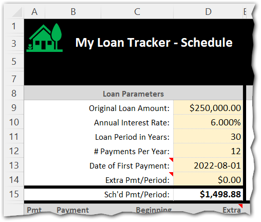
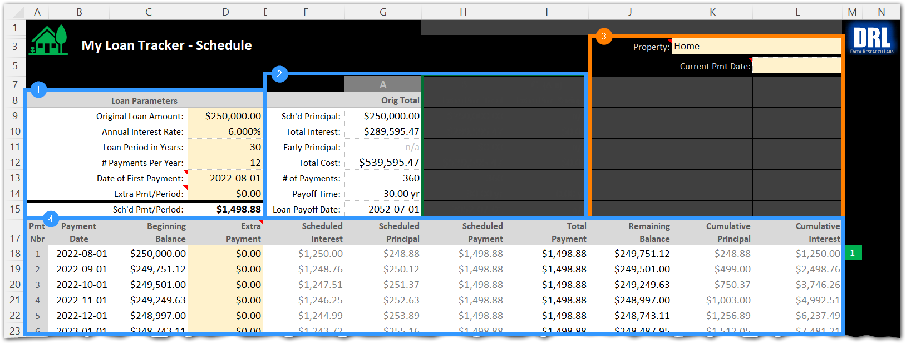
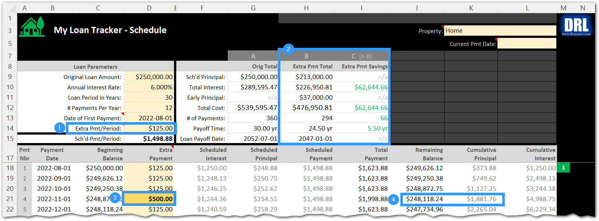
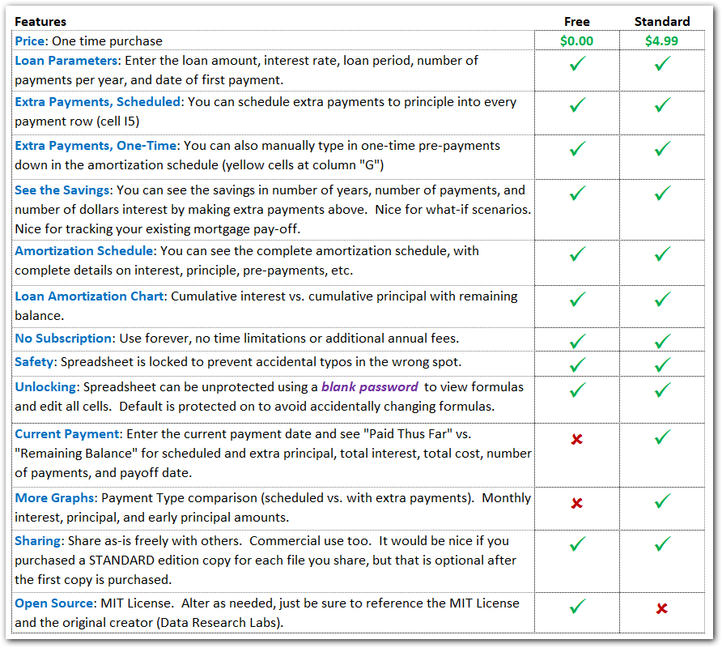

# My Loan Tracker (MLT) 
")

## 1 - Overview
* "My Loan Tracker" is loan repayment scheduler enabling you to plan, track, and adjust how much you're paying each period.  You can schedule routine "pre-payments to principle" on top of the regular period payments to reduce the total interest paid out and the lifespan of the loan.  You can even track the occasional one-off extra pre-payments.
* **FREE Edition**:  This spreadsheet is simple to use.  All the formulas are done for you. Just fill out the six Loan Parameters in yellow boxes at the upper left corner of the spreadsheet, and everything else will be auto-calculated.  You can alter the parameters to try out different scenarios.  You can even go type in "one-off" pre-payments down in the schedule for accurate change tracking.  A Graphs worksheet show the cumulative interest, cumulative principle, and remaining balance of the loan over its entrie life.  This is covered by an MIT License, enabling you to use, share and re-purpose anyway you need, including commercial use.  Most cells and formulas are locked.
* **STANDARD Edition**:  Contains everything in the FREE edition.  Adds current payment date tracking projections such as the "Paid thus Far" and "Balance Remaining" columns of data.  Also adds two additional graphs: 
1. "Payment Type" graph comparing total interest originally scheduled vs. after pre-payments are applied.   
2. "Monthly Payments" graph showing principle vs. interest as periodic payments (not cumulative)
Although all cells and formulas are locked, they are easily unprotected with a blank password.  

## 2 - Quick Start Guide

### 2.1 - Legend
The general rule is that you only type into light yellow cells, and only on the first worksheet "Amortization Schedule". 
Everything else is a calculated cell.
 

  

### 2.2 - "The Inputs" = Just 6 Loan Parameters
The following features are available in both the **FREE** and **STANDARD** Editions.  To use this spreadsheet, you just need to fill out the minimum set of parameters on the "Amortization Schedule" worksheet as follows (cross reference screenshot fields to the right):

1. **Original Loan Amount**: The total loan amount (principal) that you are borrowing and will need to pay back
2. **Annual Interest Rate**: The loan interest rate															
3. **Loan Period in Years**: The length of time in years to payoff the loan assuming no pre-payments to principal are made.  Typical values are
15-year and 30-year, but we've added 40-year too if they come about.
4. **Number of Payments Per Year**: This is typically 12 for monthly payments.
5. **Date of First Payment**: Enter the year, month and day that payments will start.  I typically prefer setting the day to the first ("1").
6. **Extra Payment / Early Principal**: This value is optional.  Leave it at $0.00 to stick with the original loan terms and length.  However, if you want to pay off the loan early and reduce total interest you can try out different values to pre-pay each period to understand the impact (example: pre-paying $500 a period might save 10.5 years off the loan and save $150,000 in interest to the bank...savings you can put to use elsewhere.  Play with this value to better understand your loan and various scenarios for paying it off faster.
  

### 2.3 - "The Outputs" = Loan Summary Box + Amortization Schedule
There are three sections on the "Amortization Schedule" worksheet shown below. 
* **Section #1** is the "**Loan Parameters**" you just entered in the previous section.  Notice that the "Payment per Period" has been calculated for you (i.e. - the Monthly payment).
* **Section #2** is the "**Loan Summary**" with the original terms including total interest paid out over the life of the loan, the total cost of the loan (principal + interest), the total number of payments, the payoff time in years, and the final payoff date.
* **Section #3** is the "Loan Tracking" fields that are only available in the **STANDARD** Edition.  These cells let you select a current payment date and see what has been "Paid thus Far" vs. the "Remaining Balance".  It also lets you set a property name that appears on this sheet and the graphs for folks that either have multiple properties, or an old house they sold vs. new house they live in now.
* **Section #4** is the "**Amortization Schedule**" showing you each payment's date, beginning balance, scheduled payment (interest + principal), total payment (including any extra principal pre-payment you enter in the yellow box), the remaining balance on the loan, the cumulative principal paid and the cumulative interest paid on the loan.

 

### 2.4 - "Pre-Payment to Principal" / Early Payoff
The following features are available in both the **FREE** and **STANDARD** Editions.  There are two ways of entering extra payments in this spreadsheet: (1) as a Loan Parameter, and (2) directly down in the amortization schedule as a one-off.
* **Bullet #1** below is where you enter a regular extra payment (to principal) that you want to occur with every scheduled payment.  In the example below, an extra $125.00 will be applied to principal every month.  You can see the $125 repeating down in the amortization schedule above and below bullet #2.  This reduces the total life of the loan by 5.42 years and 65 payments in cells I10 and I11.
* **Bullet #2** is where you enter unique one-time payments that are not scheduled.  In the example below, the user made a one-time extra payment of $500 on November 1 because she received a spot bonus at work and wanted to apply that to her mortgage principal.
* _**Pro Tip #1:** If you have already been paying your mortgage for some time and just started using this spreadsheet to track, this is where you would manually enter all of your pre-payments (type the values in over the formulas) to precisely model your current mortgage histories if you varied from the regular payments._
* _**Pro Tip #**: The way I use these two pre-payment approaches is by entering the minimum pre-payment amount I know I can hit every month (the $125 in example below at bullet #1). But then every month I try to pre-pay more and just over-type the formula in the "Extra Payments" column at bullet #2._
* **Bullet #3** shows how the Loan Summary section "lights up" after pre-payments are detected.  Notice the 
"w/Pre-Payments" column is no longer grayed out because the values changed.  Notice the "Total Savings" column with green values indicating how much money you saved by not paying interest and how much time you reduced on the life of the loan.
* **Bullet #4** shows the impact of paying extra principal above the regular scheduled amount.  For example, the remaining balance dropped by about $750 and the cumulative principal jumped from $1,127 to $1,881.

 

### 2.5 - "Payment Tracking"
The following features are only available in the **STANDARD** Edition.
* **Bullet #1** in the screenshot below is a drop-down box labeled "Current Payment Date".  This drop-down contains dates of all loan payments.  Use it to select the current pay period and popup the loan status data shown in the next bullet.
* **Bullet #2** shows the tracking data window that appears upon selecting the most recent payment date.  The left column is titled "Paid Thus Far" and the right column is "Balance Remaining".  Use these columns to see how many payments, years, and dollars are completed thus far versus the balance remaining.

  

## 3 - "Open Source"
### 3.1 - This Product is Open Source
There are two editions of this spreadsheet: **FREE** and **STANDARD**.  Feature comparison as follows:

  

### 3.2 - Purchasing Products & Services
I put a lot of time and energy into making this tool.  If you use the **FREE** Edition for a couple of years and find it meets your needs well, then at that time please consider purchasing one copy of the **STANDARD** Edition to help me out.  Likewise, if you purchase one copy of the **STANDARD** Edition and are sharing it with your friends and clients, then please consider making those into purchases -- no obligation, just where it makes sense.   
Finally, I'd be happy to re-brand the template for bulk purchases, site licenses, etc. (or you can do it yourself via the open source **FREE** Edition).  

|Action | URL |
|:----------------------------------|:----------------------------------|
| To purchase the **STANDARD** Edition on Etsy: | https://www.etsy.com/shop/DataResearchLabs |
| To download the FREE Edition on GitHub: | https://github.com/dataresearchlabs/my_loan_tracker |
| To email me about re-branding or other visit: | https://dataresearchlabs.com/contact-us |

### 3.3 - How to "Unlock" the Spreadsheet (for editing / to view formulas)
1. Download or purchase a copy of the spreadsheet
2. Open the file in XL  and click the "Amortization Schedule" tab
3. Click menu items "Home"  >  "Format"  >  "Unprotect Sheet"
4. Because this open source, leave the password blank...the worksheet is simply unlocked
  

## 4 - Additional Training
For aditional training and related materials, please visit my YouTube site at: https://www.youtube.com/c/DataResearchLabs/featured														

