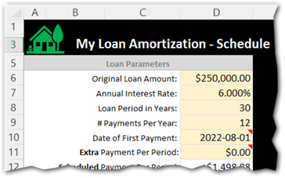
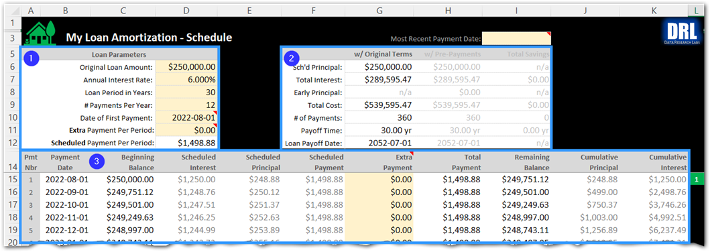

# My Loan Amortization (MLA) 
")

## 1 - Overview
* "My Loan Amortization" is loan repayment scheduler enabling you to plan, track, and adjust how much you're paying each period.  You can schedule routine "pre-payments to principle" on top of the regular period payments to reduce the total interest paid out and the lifespan of the loan.  You can even track the occasional one-off extra pre-payments.
* The tool is simple to use.  All the formulas are done for you. Just fill out the six Loan Parameters in yellow boxes at the upper left corner of the spreadsheet, and everything else will be auto-calculated.  You can alter the paramters to try out different scenarios.  You can even go type in "one-off" pre-payments down in the schedule for accurate change tracking.
* View the Graphs tab to see a standard "Loan Amortization Chart" depicting remaining balance, principle, and interest paid at any given point in the life of the loan.  There is also a "Payment Type" graph comparing total interest as originally scheduled versus after pre-payments have been applied.  

## 2 - Quick Start Guide

### 2.1 - Legend

The general rule is that you only type into light yellow cells, and only on the first worksheet "Amortization Schedule".  Everything else is a calculated cell.
  

### 2.2 - "The Inputs" = Just 6 Loan Parameters
To use this spreadsheet, you just need to fill out the minimum set of parameters on the "Amortization Schedule" worksheet as follows (cross reference screenshot fields to the right):

1. **Original Loan Amount**: The total loan amount (principal) that you are borrowing and will need to pay back
2. **Annual Interest Rate**: The loan interest rate															
3. **Loan Period in Years**: The length of time in years to payoff the loan assuming no pre-payments to principal are made.  Typical values are
15-year and 30-year, but we've added 40-year too if they come about.
4. **Number of Payments Per Year**: This is typically 12 for monthly payments.
5. **Date of First Payment**: Enter the year, month and day that payments will start.  I typically prefer setting the day to the first ("1").
6. **Extra Payment / Early Principal**: This value is optional.  Leave it at $0.00 to stick with the original loan terms and length.  However, if you want to pay off the loan early and reduce total interest you can try out different values to pre-pay each period to understand the impact (example: pre-paying $500 a period might save 10.5 years off the loan and save $150,000 in interest to the bank...savings you can put to use elsewhere.  Play with this value to better understand your loan and various scenarios for paying it off faster.
  

### 2.3 - "The Outputs" = Loan Summary Box + Amortization Schedule
There are three sections on the "Amortization Schedule" worksheet shown below. 
* **Section #1** is the "**Loan Parameters**" you just entered in the previous section.  Notice that the "Payment per Period" has been calculated for you (i.e. - the Monthly payment).
* **Section #2** is the "**Loan Summary**" with the original terms including total interest paid out over the life of the loan, the total cost of the loan (principal + interest), the total number of payments, the payoff time in years, and the final payoff date.
* **Section #3** is the "**Amortization Schedule**" showing you each payment's date, beginning balance, scheduled payment (interest + principal), total payment (including any extra principal pre-payment you enter in the yellow box), the remaining balance on the loan, the cumulative principal paid and the cumulative interest paid on the loan.

  

### 2.4 - "Pre-Payment to Principal" / Early Payoff

